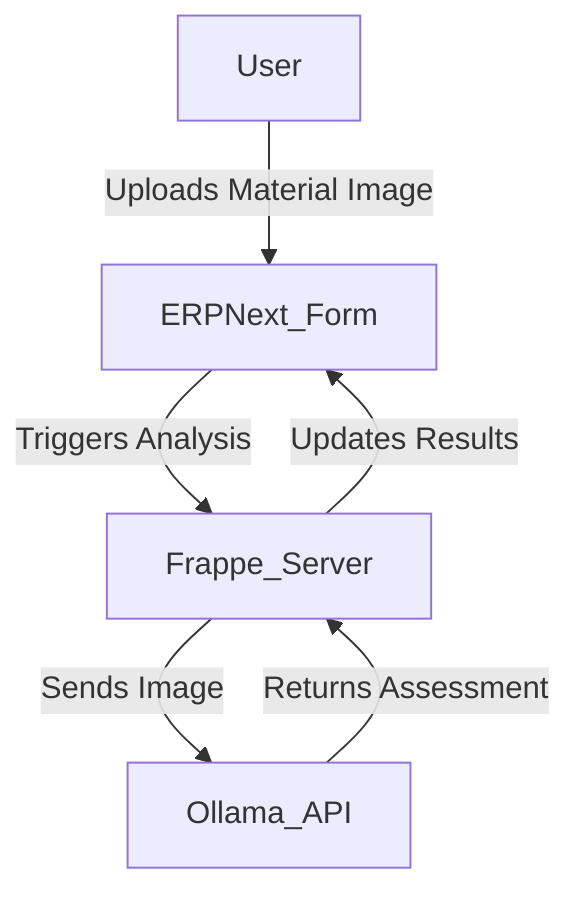

# AI Quality Checker for ERPNext

## Live/Demo Link
[Demo Link Placeholder]

---

## Overview
AI Quality Checker is a custom Frappe app for ERPNext that automates material quality inspections using AI vision models (Ollama/llava). It enables manufacturers to perform rapid, automated visual checks on incoming materials, reducing manual effort and improving quality assurance.

---

## Architecture Diagram


---

## Features
- AI-powered material inspection using vision models
- Custom DocType for Material Quality Inspection
- Automated status, confidence score, and remarks
- Script Report: AI Quality Inspection Log
- Dockerized deployment for production
- GitHub Actions CI/CD pipeline

---

## Local Setup Instructions

### 1. Set up a new Frappe bench
```bash
bench init erpnext-bench --frappe-branch version-15
cd erpnext-bench
bench new-site site1.local
```

### 2. Download and install this custom app
```bash
bench get-app https://github.com/yourusername/ai_quality_checker.git
bench --site site1.local install-app ai_quality_checker
```

### 3. Install Ollama and run the llava model
- [Ollama Installation Guide](https://ollama.com/download)
- Run: `ollama run llava`

### 4. Start the bench
```bash
bench start
```

---

## Deployment to Cloud (AWS/GCP)

### 1. Provision a VM (EC2, Compute Engine)
- Choose Ubuntu 22.04 or similar

### 2. Install Docker
```bash
sudo apt update && sudo apt install -y docker.io
```

### 3. Pull the image from Docker Hub
```bash
docker pull yourusername/ai-quality-checker:latest
```

### 4. Run the container
```bash
docker run -d -p 8000:8000 --name ai-quality-checker \
  -e FRAPPE_SITE_NAME=site1.local \
  yourusername/ai-quality-checker:latest
```

---

## License
MIT

---

## Contact
For support, open an issue on GitHub or email your.email@example.com
