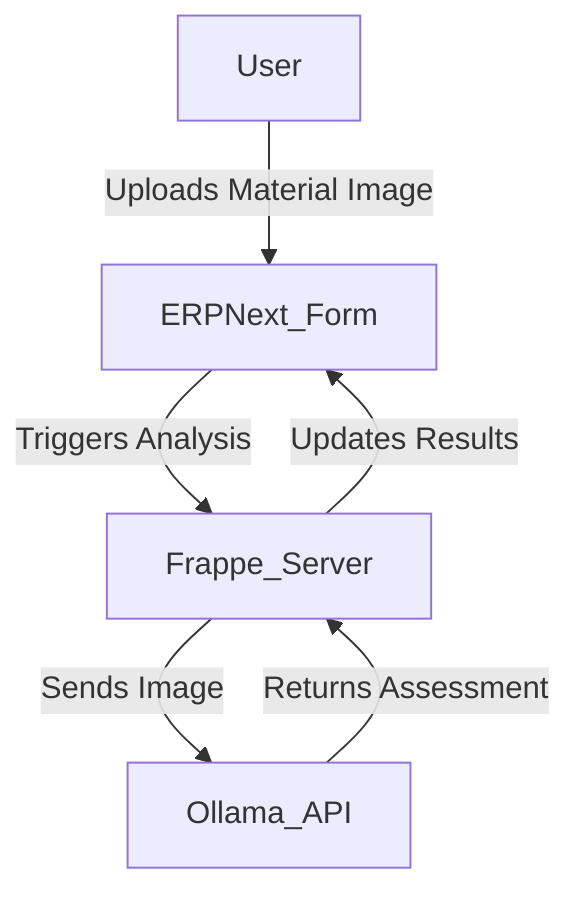

# AI Quality Checker for ERPNext

## Live/Demo Link
[Demo Link Placeholder]


## Overview
AI Quality Checker is a custom Frappe app for ERPNext that automates material quality inspections using AI vision models (Ollama/llava). It enables manufacturers to perform rapid, automated visual checks on incoming materials, reducing manual effort and improving quality assurance.


## Architecture Diagram



## Features
 AI-powered quality checking via backend API
 Modern frontend UI (HTML/JS/CSS)
 Dockerized for easy deployment
 Supports multi-container setup with Ollama (via Docker Compose)


## Local Setup Instructions

### Prerequisites
- Docker
- Docker Compose (optional, for multi-container setup)

### Build the Docker Image
```bash
docker build -t ai_quality_checker .
```

### Run the Container
```bash
docker run -d -p 8000:8000 --name ai_quality_container ai_quality_checker
```
Access the app at [http://localhost:8000](http://localhost:8000)

### Using Docker Compose (with Ollama)
Create a `docker-compose.yml`:
```yaml
version: '3.8'
services:
  frappe:
    image: ai_quality_checker
    ports:
      - "8000:8000"
    depends_on:
      - ollama
    environment:
      FRAPPE_SITE_NAME: site1.local
  ollama:
    image: ollama/ollama:latest
    ports:
      - "11434:11434"
```
Run both services:
```bash
docker-compose up -d
```

## Frontend
- Located at `ai_quality_checker/ai_quality_checker/public/js/quality_checker.js`
- Modern UI for material quality checking

## Backend API
- Example endpoint: `/api/method/ai_quality_checker.api.check_quality`
- Accepts POST requests with `{ material: "Material Name" }`

## Development
- App code is in `ai_quality_checker/`
- DocType, reports, and JS assets are organized by Frappe conventions


### 1. Set up a new Frappe bench
```bash
cd erpnext-bench
bench new-site site1.local
fister12
```

### 2. Download and install this custom app
```bash
bench get-app https://github.com/yourusername/ai_quality_checker.git
bench --site site1.local install-app ai_quality_checker
```

### 3. Install Ollama and run the llava model
- [Ollama Installation Guide](https://ollama.com/download)
- Run: `ollama run llava`

### 4. Start the bench
```bash
bench start
```

---

## Deployment to Cloud (AWS/GCP)

### 1. Provision a VM (EC2, Compute Engine)
- Choose Ubuntu 22.04 or similar

### 2. Install Docker
```bash
sudo apt update && sudo apt install -y docker.io
```

### 3. Pull the image from Docker Hub
```bash
docker pull yourusername/ai-quality-checker:latest
```

### 4. Run the container
```bash
docker run -d -p 8000:8000 --name ai-quality-checker \
  -e FRAPPE_SITE_NAME=site1.local \
  yourusername/ai-quality-checker:latest
```

---

## License
MIT

---

## Contact
For support, open an issue on GitHub or email your.email@example.com
